# notion-quick-action

NotionQuickAction.workflow はNotion のタスクデータベースのページとカレンダーイベントを同時に登録してくれる macOS サービスです。

## インストール方法

- 以下のリンクから NotionQuickAction.workflow をダウンロードします。
[https://github.com/hkob/notion-quick-action/releases/download/1.1/NotionQuickAction.workflow.zip]

- zip ファイルのままの場合には展開します。
- workflow を実行します。
- 以下のような画面が出るので、インストールをクリックします。

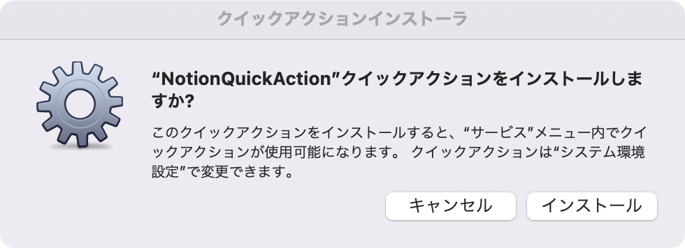

- `NotionQuickAction` がキーボードのショートカットに現れます。チェックをつけた上で、自分の好きなショートカットを割り当ててください。ここでは、`option` + `command` + N を設定しています。

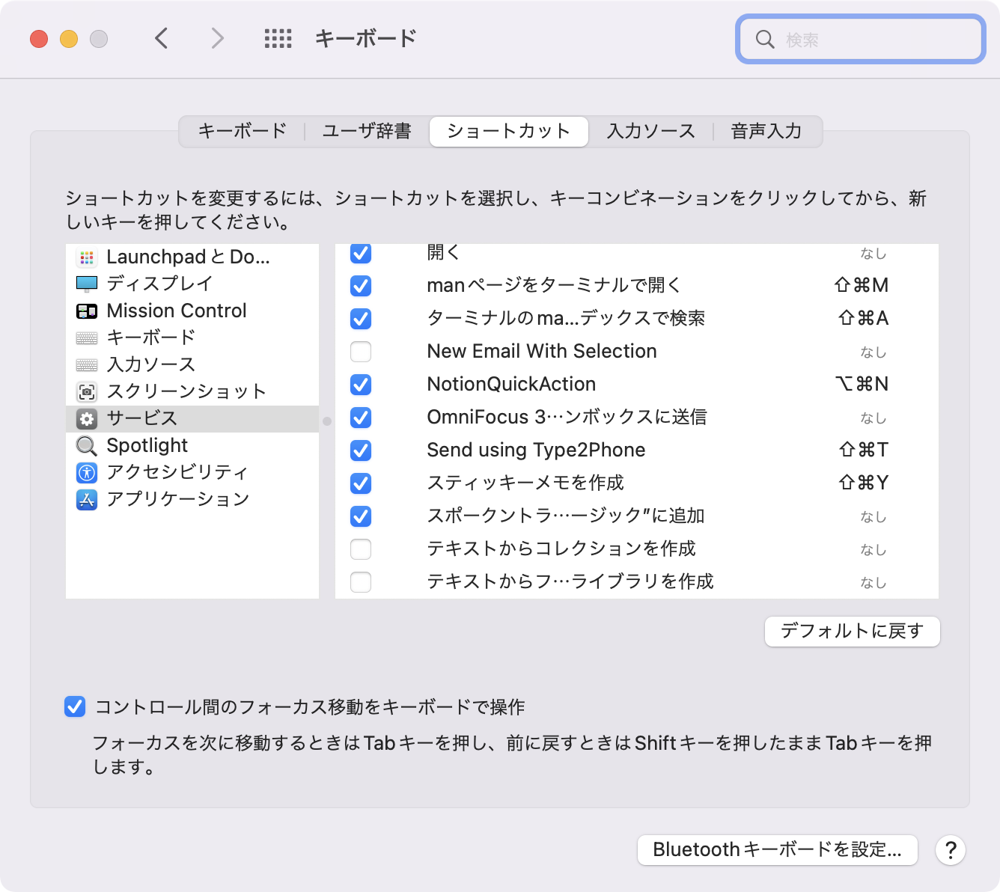

- ターミナルを立ち上げます。
- 以下のコマンドをタイプして、NotionQuickAction.workflow を開きます。

```sh
open $HOME/Library/Services/NotionQuickAction.workflow
```

- Automator が開き、以下のような画面になります。上の `Run Javascript` の部分に JXA code (JavaScript 版の AppleScript) が表示されています。

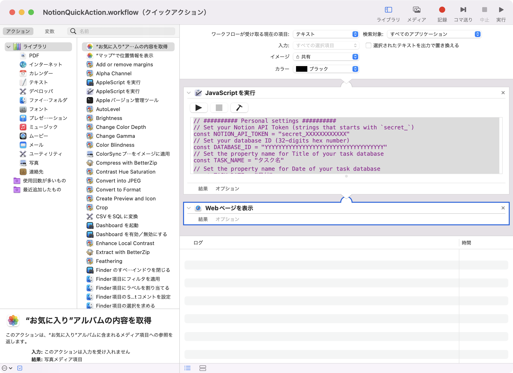

- 先頭部分に以下の 8 つの設定項目が変数で定義されています。自分のものに合わせて中身を修正してください。なお、NOTION_API_TOKEN や DATABASE_ID についてわからない人は、下の NOTION API の設定を先に実施してから、値を設定してください。

```Javascript
// ########## Personal settings ##########
// Notion API Token を設定します (`secret_` で始まる文字列です)。
const NOTION_API_TOKEN = "secret_XXXXXXXXXXXX"
// 登録するタスクデータベースの ID を設定します (32桁の16進数です)。
const DATABASE_ID = "YYYYYYYYYYYYYYYYYYYYYYYYYYYYYYYYYYY"
// タスクデータベースのタイトルプロパティの名前を設定します。
const TASK_NAME = "タスク名"
// タスクデータベースの日付プロパティの名前を設定します。
const TASK_DATE = "日付"
// タイムゾーンを設定します (https://www.iana.org/time-zones を見てください。日本の人はこのままでいいです)。
const TIME_ZONE = "Asia/Tokyo"
// Notion タスクと同時にカレンダーにイベントを登録したい人は true にしてください。したくない人は false にします。
const ADD_CALENDAR = true
// 登録するカレンダーの名前を設定します。
const NOTION_CALENDAR = "Notion"
// 登録後にページが開きます。Notion.app で開きたい人は true にしてください。false にするとデフォルトブラウザで開きます。
const OPEN_BY_APP = true
```

## Notion API の設定

初めての人のために、Notion API の設定方法も説明しておきます。

- 最初に Notion の設定を開き、インテグレーションタブを開きます。
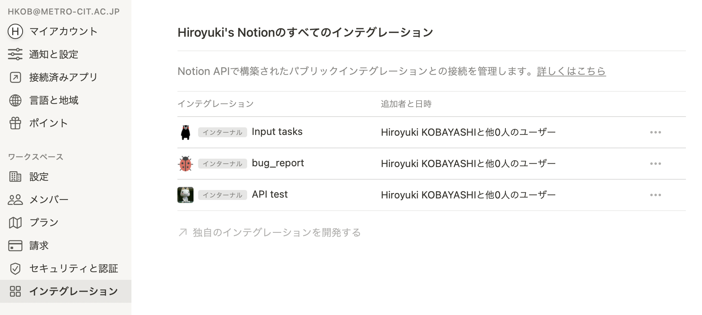

- 次に「独自のインテグレーションを開始する」をクリックします。以下のような画面になるので、「新しいインテグレーション」をクリックします。
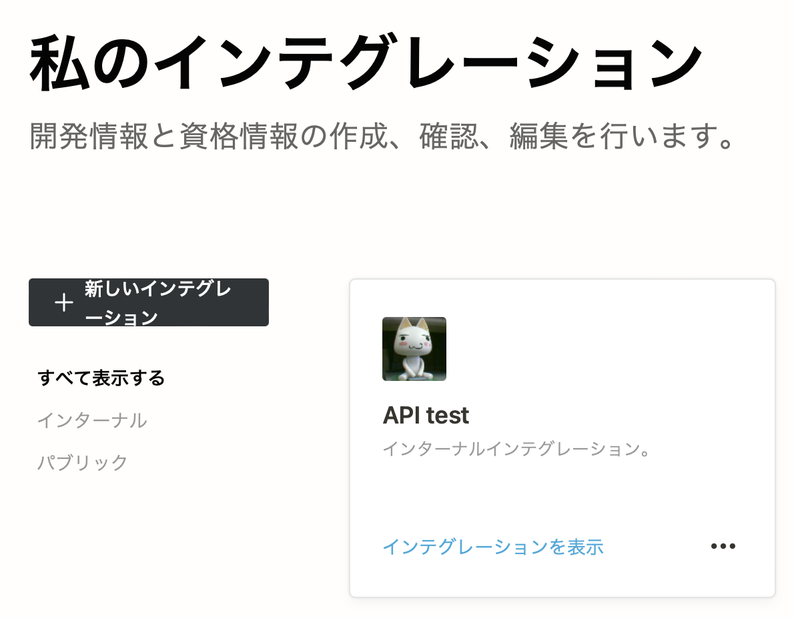

- 上の部分の名前、画像は好きなものを設定してください。ワークスペースは自動的に設定されているはずです。複数のワークスペースを持っている人は利用するワークスペースを選択してください。
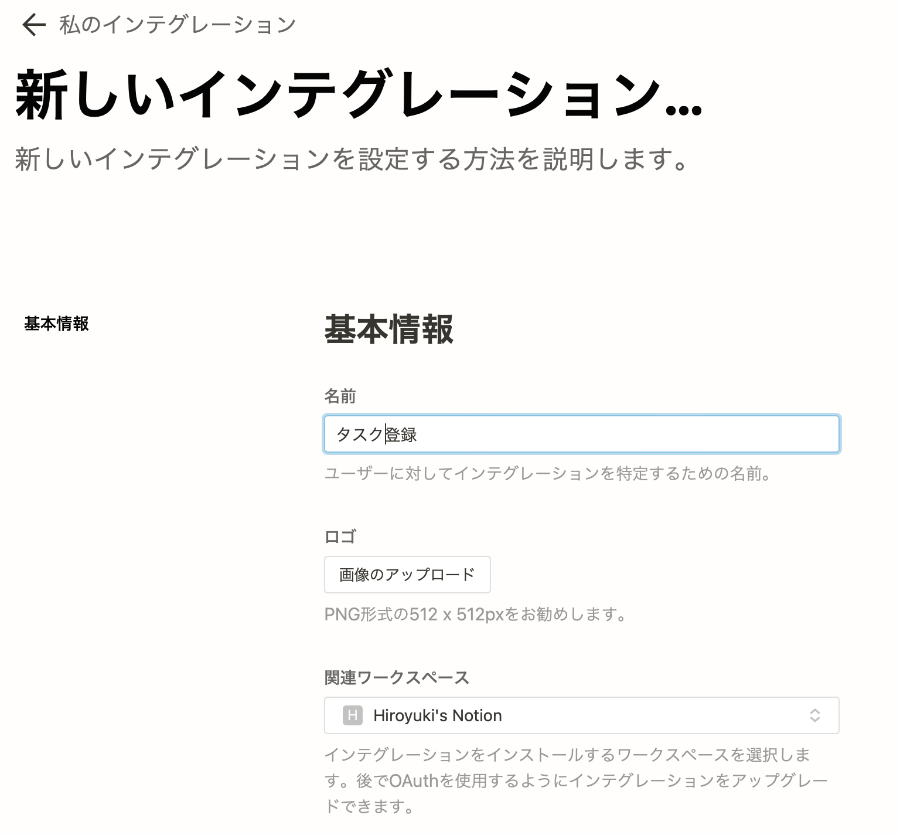

- コンテンツ機能は今回すべてチェックします。ユーザに関する情報は必要ないので、ユーザー情報なしでよいです。
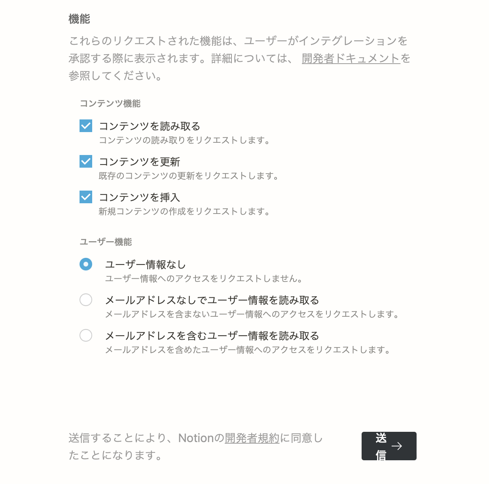

- 送信をクリックすると画面が変わり、上にシークレットが表示されます。「表示」をクリックすると `secret_` で始まる文字列が表示されます。右にあるコピーをクリックするとクリップボードにコピーされるので、NotionQuickAction の NOTION_API_TOKEN の部分に貼り付けてください。
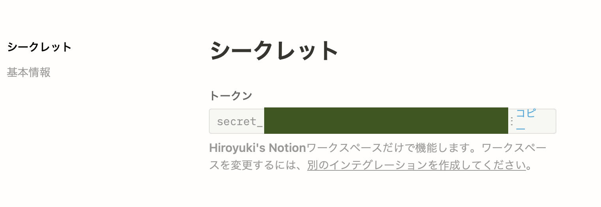

## インテグレーションの許可

次に登録するデータベースを開きます。リンクドデータベースがある場合には、`右上矢印 + データベース名` の部分をクリックすればデータベースのページが単体で開きます。インラインのデータベースの場合には、`...` から「ページとして開く」をクリックして開きます。
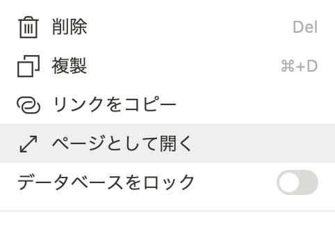

このデータベースを API からアクセスできるように、右上の`共有`で開くダイアログにて先ほど作成したインテグレーションを招待します。
追加ができるように編集権限を与えてください。

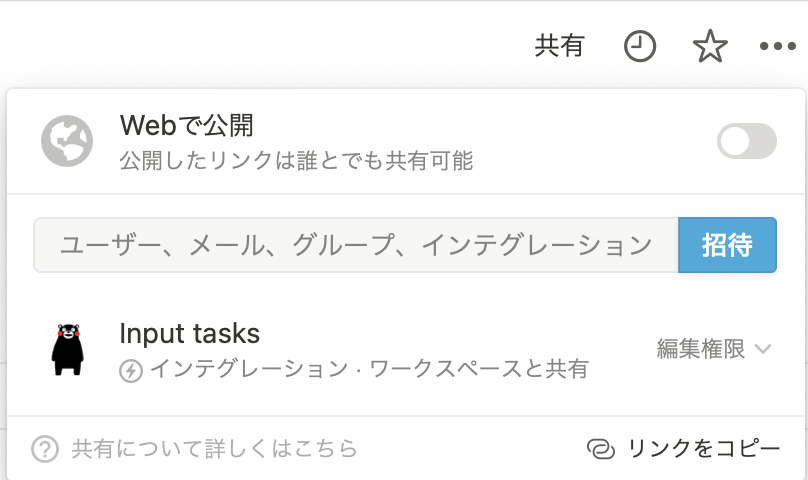

## データベース id の取得

最後に DATABASE_ID を取得します。許可したデータベースをページで表示した状態で、メニューから「リンクをコピー」をクリックします。

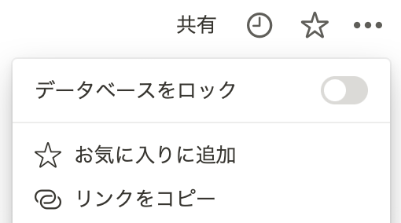

コピーしたリンクは以下の形式になっています。この 32 桁の XXXX... の部分がデータベース ID になります。この部分だけを取り出して、ワークシートの DATABASE_ID に設定してください。

```text
https://www.notion.so/hkob/XXXXXXXXXXXXXXXXXXXXXXXXXXXXXXXX?v=YYYYYYYYYYYYYYYYYYYYYYYYYYYYYYYY
```

## 使い方

テキストが選択できるアプリケーションであれば、なんでも利用可能です。テキストを選んだ状態で、設定したショートカットキーを押してください。時間を設定するダイアログが表示されるので、以下のように設定してください。

- フルフォーマット(`YYYY/MM/DD H1:M1 H2:M2` または `MM/DD H1:M1 H2:M2`): 日付と時間を全て設定した場合です。`1/27 8:00 17:00` とした場合、1月27日の8時から17時までのタスクになります。年を省略した場合には今年になります。
- 終了時間を省略(`YYYY/MM/DD HH:MM` または `MM/DD HH:MM`): 終了時間を省略した場合には、開始時間の1時間後が自動的に設定されます。`1/27 8:00` とした場合、1月27日の8時から9時までのタスクになります。
- 日付のみ(`MM/DD` または `YYYY/MM/DD`): 日付のみ設定されます。`1/27` とした場合には 1月27日、2023/1/10 とした場合には、2023年1月10日になります。
- 開始時間と終了時間(`H1:M1 H2:M2`): 時間のみを設定した場合には、今日の日付が補間されます。`9:00 17:00` とした場合には、今日の 9時から17時までとなります。
- 開始時間のみ(`HH:MM`): 開始時間のみを設定した場合には、今日の日付が補間され、終了時間は開始時間の1時間後になります。9:00 とした場合には、今日の 9時から10時までとなります。
- 空欄: 時間は設定されません。この場合、カレンダーにも登録はされません

リターンキーを押すか `Continue` ボタンを押すと、数秒で Notion にタスクが登録され、Notion.app かブラウザで作成したページが表示されます。さらに、カレンダー登録もオンにした場合には、カレンダーにもタスクが登録されます。カレンダーの description には Notion ページの id も `id:ページid` の形で登録されています。頭の `id:` が邪魔な場合には、スクリプトを修正してください(説明を追加してあります)。


- [ブログでの解説](https://hkob.hatenablog.com/entry/2022/01/08/130000)

## 更新履歴

- Ver. 1.1
  - シングルクオートがあった時にエラーになっていたのでエスケープするようにした

- Ver. 1.0
  - 最初のリリース
