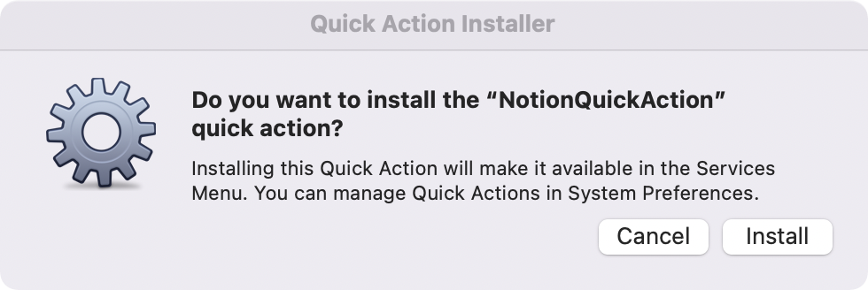
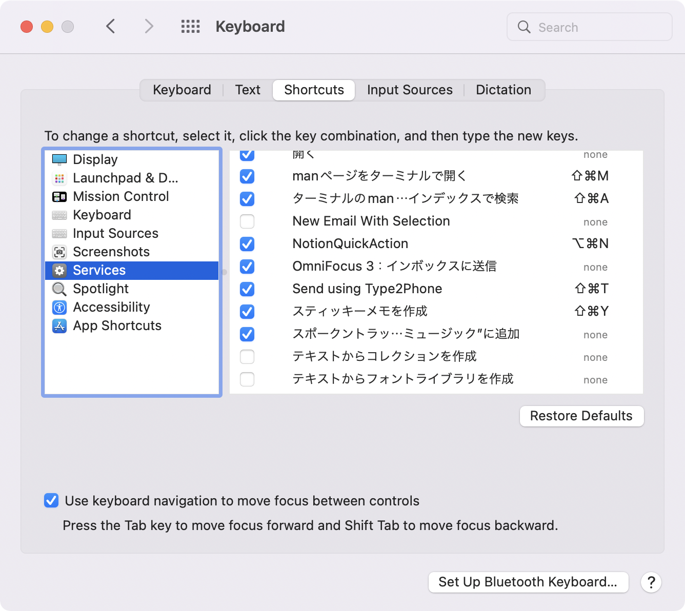
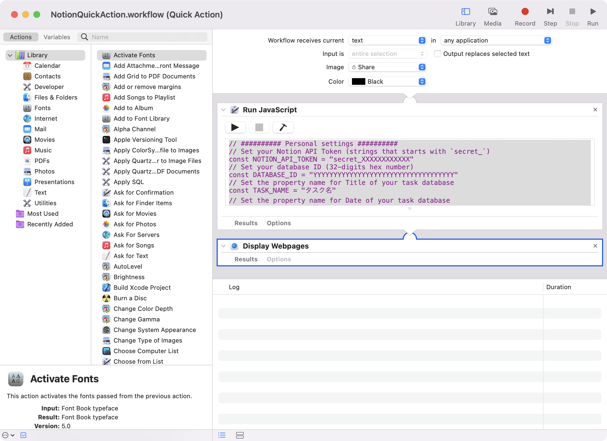
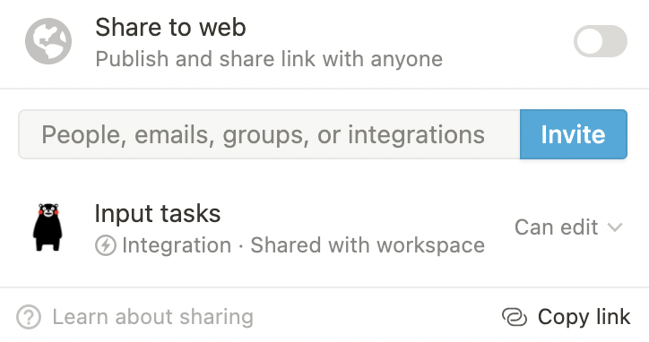

# notion-quick-action

a macOS service to add a new notion task and a calendar event

[日本語版 README はこちら](README.ja.md)

## How to install

- Download workflow from here
[https://github.com/hkob/notion-quick-action/releases/download/1.1/NotionQuickAction.workflow.zip]

- Unpack the zip file
- Down click the workflow file
- Click Install in the following dialog



- Enable `NotionQuickAction` and set a shortcut key.  In this figure, I set `option` + `command` + N.



- Open Terminal software.
- Open NotionQuickAction.workflow by the following terminal command.

```sh
open $HOME/Library/Services/NotionQuickAction.workflow
```

- We can see a JXA code in a `Run JavaScript` action.



- Rewrite some values

The following 8 values must be adjust to your environment.
In you don't know about NOTION_API_TOKEN and DATABASE_ID,
please read the below Notion API setup.

```Javascript
// ########## Personal settings ##########
// Set your Notion API Token (strings that starts with `secret_`)
const NOTION_API_TOKEN = "secret_XXXXXXXXXXXX"
// Set your database ID (32-digits hex number)
const DATABASE_ID = "YYYYYYYYYYYYYYYYYYYYYYYYYYYYYYYYYYY"
// Set the property name for Title of your task database
const TASK_NAME = "タスク名"
// Set the property name for Date of your task database
const TASK_DATE = "日付"
// time zone of your country (see https://www.iana.org/time-zones)
const TIME_ZONE = "Asia/Tokyo"
// If you want to settle a Calendar event of your task, set true.
const ADD_CALENDAR = true
// Set Calendar name for Notion tasks
const NOTION_CALENDAR = "Notion"
// If you want to open a new task by Notion.app, set true.  If you want to open it by your default browser, set false.
const OPEN_BY_APP = true
```

## Notion API setup

Next, set API setting. Please see Getting Started in the Notion Developer page. Please remind NOTION_API_TOKEN and database_id for the above database (DATABASE_ID), and invite your integration to the databases.



## How to use

Any application that allows text selection can be used.
After you selected some text, press the shortcut key for QuickLookAction.
Please type date and time strings as follows.

- Full format(`YYYY/MM/DD H1:M1 H2:M2` or `MM/DD H1:M1 H2:M2`):
Set start time and end time.
Set all date and time.  If you type `1/27 8:00 17:00, a task from 8:00 to 17:00 on January 27 is generated. If you omit the year (YYYY/), it will be this year.
- Omit end time (`YYYY/MM/DD HH:MM` or `MM/DD HH:MM`):
If the end time is omitted, one hour after the start time is set automatically.
If you type `1/27 8:00`, a task from 8:00 to 9:00 on January 27 is generated.
- Only date (`MM/DD` or `YYYY/MM/DD`):
Only date are set.
If you type `1/27`, a task on January 27 is generated.
If you type `2023/1/10`, a task on January 10, 2023 is generated.
- Start time and end time (`H1:M1 H2:M2`):
If you set only time, today's date will be interpolated.
If you type `9:00 17:00`, a task from 9:00 to 17:00 today is generated.
- Start time only (`HH:MM`):
If you type only the start time, today's date is interpolated and the end time will be one hour after the start time. If `9:00`, a task from 9:00 to 10:00 today is generated.
- Blank: Time is not set. In this case, the generated task is not registered in the calendar

After you press the return key or press the `CONTINUE` button, a task is generated in a few seconds and is displayed in Notion.app or your default browser.
In addition, if calendar registration is also turned on, a task event is also registered in your calendar.
The ID of the NOTION page is also registered in the event description field as `id:page_id`.


- [blog in Japanese](https://hkob.hatenablog.com/entry/2022/01/08/130000)

## Change Log

- Ver. 1.1
  - Bug fix: escape single quote

- Ver. 1.0
  - First release
